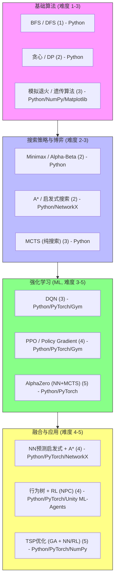

传统搜索 → 启发式 → 强化学习 → AlphaZero

### 传统算法（Classic Search / Optimization）
    目标：最优路径/价值，一个可解释的解
    动作：搜索与优化​
    1. MCTS (纯搜索版)
    2. Flat Monte Carlo Sampling
    3. A*, BFS, DFS
    4. 启发式搜索 / 启发式贪心
    5. 模拟退火 / 遗传算法
    6. 动态规划 (DP)
    7. 贪心算法 (Greedy)

### 现代机器学习驱动算法（Model-based / Model-free Learning）
    目标：最大化长期回报，提供解题的方法
    动作：学习与泛化​
    1. DQN (Deep Q-Network) 深度强化学习
    2. PPO (Proximal Policy Optimization) 深度强化学习
    3. AlphaZero 式 MCTS (MCTS + NN)
    4. 启发式 + Monte Carlo（Hybrid）

### 互补与融合​​
    两者并非取代关系，而是互补和融合。
    最典型的例子就是​​AlphaZero​​，它成功地将​​传统搜索算法（MCTS）​​ 与​​现代深度学习（价值/策略网络）​​ 结合起来，实现了1+1>2的效果。
    在很多应用中，也会用传统算法进行预处理，或用机器学习模型为传统算法（如A*）提供更好的启发式函数

### 数据规模定义
    - 小规模​，​几百至几千条，适合传统机器学习
    - 中等规模​​，一万至十万条，传统机器学习 / 轻量深度学习
    - 大规模​​，​​数十万至百万条以上​。对于图像、语音、自然语言等​​非结构化数据(信息密度高、特征复杂)

### 游戏行业
    - 路径寻找（Pathfinding）
    - 行为树（Behavior Trees）​​ 
    - ​有限状态机（Finite State Machines）
    - 蒙特卡洛树搜索（MCTS）​​ 
    - ​​Minimax算法​​（配合Alpha-Beta剪枝）
### 实践
    阶段 1：传统算法入门（基础练手）
    目标：理解基础搜索和优化思想

        BFS/DFS
        练习：迷宫求解、最短路径查找
        输出：路径和节点访问顺序

        贪心算法
        练习：背包问题（0-1 背包）
        输出：贪心策略解 vs DP 最优解比较

        动态规划 (DP)
        练习：最长公共子序列 (LCS)、矩阵连乘
        输出：最优解、状态转移表

        模拟退火 / 遗传算法
        练习：TSP (旅行商问题)
        输出：迭代曲线收敛效果

    阶段 2：搜索策略与博弈（中级练手）
    目标：理解搜索策略和决策树

        Minimax + Alpha-Beta
        练习：井字棋或小棋盘国际象棋
        输出：最优策略和搜索树可视化

        蒙特卡洛树搜索 (MCTS)
        练习：井字棋、Connect4
        输出：胜率随模拟次数变化曲线

        启发式搜索 (A, 启发式贪心)*
        练习：路径规划（地图寻路）
        输出：节点扩展顺序、路径成本对比

    阶段 3：强化学习入门（现代算法）
    目标：理解 RL 原理与网络训练

        DQN
        练习：CartPole 平衡杆
        输出：训练曲线、策略可视化

        PPO / Policy Gradient
        练习：LunarLander 或连续动作控制
        输出：奖励曲线、策略动作分布

        AlphaZero 式 MCTS+NN
        练习：简化井字棋
        输出：策略网络训练过程 + MCTS 搜索结果

    阶段 4：融合与应用（高级工程实践）
    目标：实现传统算法 + ML 的协同应用

        启发式 + RL / NN
        练习：训练 NN 预测 A* 启发式函数，提高搜索速度
        输出：搜索节点数对比

        模拟游戏智能 NPC
        练习：使用行为树 + RL 调节策略
        输出：NPC 学会适应玩家策略

        TSP / 路径优化
        练习：遗传算法 + RL 或 NN 预测初始解
        输出：优化结果 + 收敛对比

### 技能图
